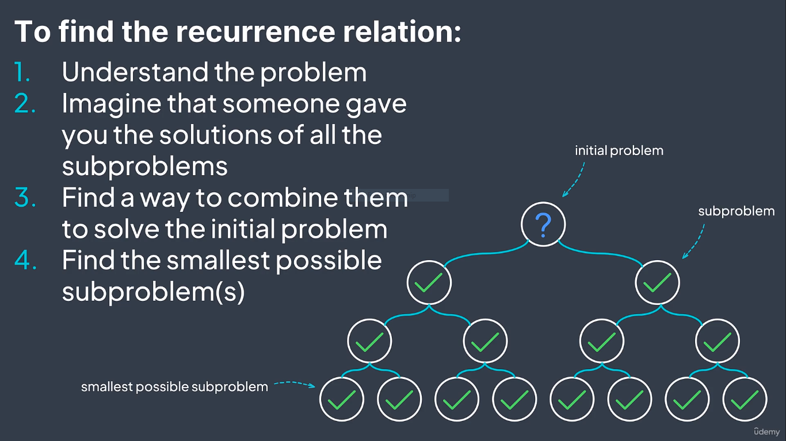
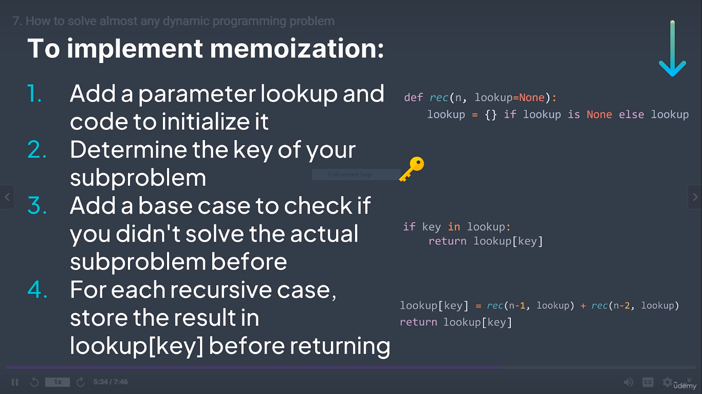

Dynamic Programming is applied to optimised solutions when following two cases occur simultaneously
1. Optimal Substructure i.e. a big problem can be divided into multiple smaller and similar problems.
2. There are overlapping solutions of  sub-problems.

Note : For example, Merge Sort which does not follow 2nd property, cannot be solved using DP.

DP can be used to provide optimised solutions in most of the cases ie find maximum or min, find longest
or shortest but not just limited to that

To check, if subproblems have overlapping solution, Create a DAG of all the subproblems and their recurrence relation.
If more than one vertexes come to a node, it means there exists overlapping solution.

There are two approaches:
1. Top Down Approach (Memoization)
  
2. Bottom-up Approach (Tabulation) :
    In this approach, we start from the smallest subproblem whose solution is known to us and keep on building the solution 
    of bigger subproblem till we get the required problem solution.
    - Mostly we use 1D or 2D array to store outputs depending upon number of 
    variable in our problems which can be further optimised. The same can be visualised as Directed Acyclic Graph (DAG).  